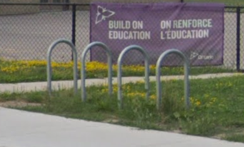
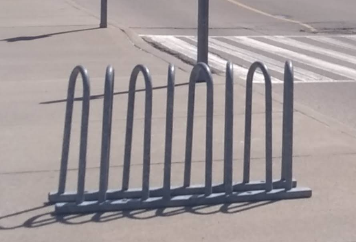
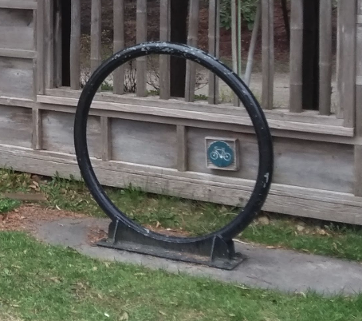
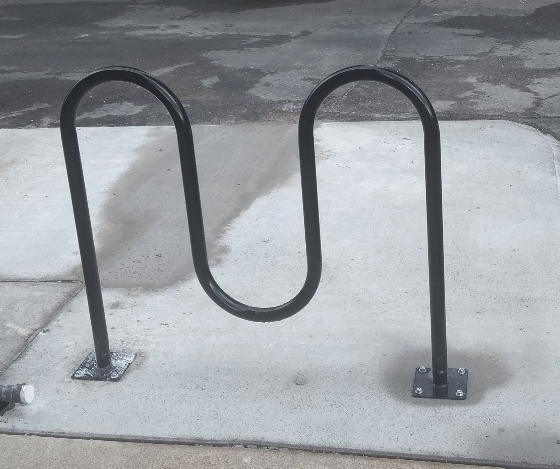
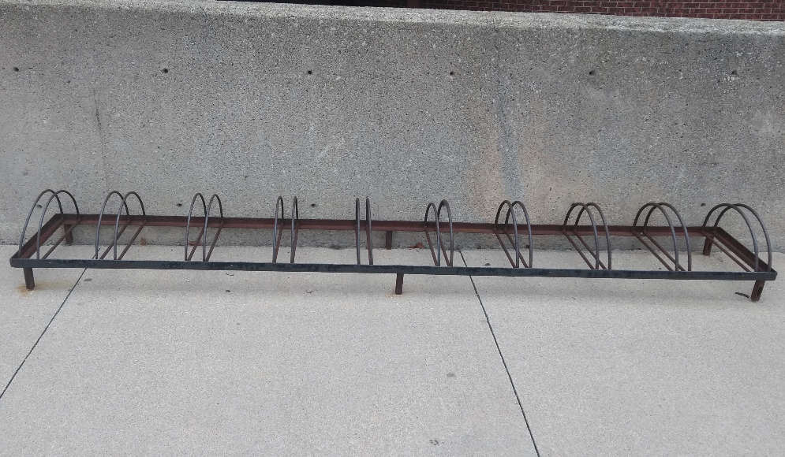
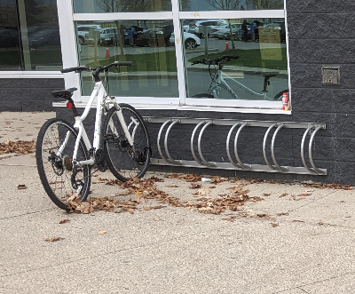
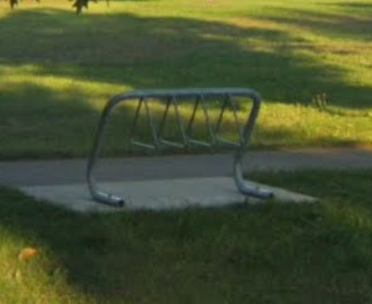
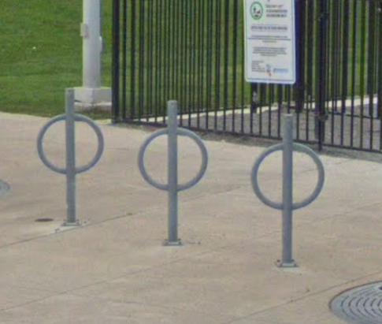
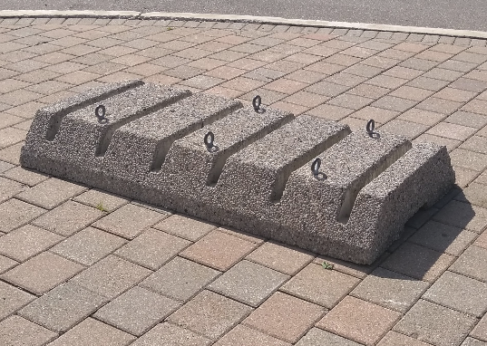

# OSM MCAC Bike Parking Tagging Guide

## Table of Contents

<ul>
  <li><a href='#Parking-Attributes'>Bike Parking Attributes</a></li>
  <li><a href='#Parking-Types'>Bike Parking Types</a></li>
  <li><a href='#Parking-Capacity'>Bike Parking Capacity</a></li>
</ul>

<h2 id="Parking-Attributes">Bike Parking Attributes</h2>

| Tag   | Description      |
| ----- | ---------------- |
| <a href="https://wiki.openstreetmap.org/wiki/Key:name">name</a>=* |	Larger areas of bike parking may be named.|
| <a href="https://wiki.openstreetmap.org/wiki/Key:operator">operator</a>=* | 	Cycle parking may be operated by some organisation.|
| <a href="https://wiki.openstreetmap.org/wiki/Key:covered">covered</a>=* | 	Parked bikes are protected from rain. |
| <a href="https://wiki.openstreetmap.org/wiki/Key:access">access</a>=* |	Public access is implied in most roadside cases. Some bike racks may be private with access limited to memberts of a university, company, or other organisation, possibly requiring keys or codes to access. |
| <a href="https://wiki.openstreetmap.org/wiki/Key:capacity">capacity</a>=* | 	The number of bikes that can be parked here. |
| <a href="https://wiki.openstreetmap.org/wiki/Key:fee">fee</a>=* |	In some places, one must pay to park one's bike. |
| <a href="https://wiki.openstreetmap.org/wiki/Key:bicycle_parking">bicycle_parking</a>=* | 	Details the type of bicycle parking (e.g. stands, wall loops...).|
| <a href="https://wiki.openstreetmap.org/wiki/Key:cyclestreets_id">cyclestreets_id</a>=* | 	A link to the ID (e.g. 12345) of the location describing a photo of the cycle parking in CycleStreets. Multiple IDs should be separated by semi-colons. |
| <a href="https://wiki.openstreetmap.org/wiki/Key:maxstay">maxstay</a>=* |	Maximum time the bicycle is allowed to be parked at that place - given sometimes at covered parking-places.|
| <a href="https://wiki.openstreetmap.org/wiki/Key:surveillance">surveillance</a>=* |	Closed-circuit television (CCTV) security cameras can be marked with this. See the linked page for details of the values in use. Depending on the layout, a separate node nearby may be enough. |

<h2 id="Parking-Types">Bike Parking Types</h2>

|Key 	|Value 	|Element 	|Comment 	|Photo |
|--|--|--|--|--|
|bicycle_parking |stands |  |	A bent piece of metal against which you can lean your entire bicycle. Makes it possible to lock the frame and a wheel to it. Moderate security. Rectangular stands are sometimes called "staple racks" in North America due to their shape, and "Sheffield stands" in the UK. Use this tag for non-rectangular stands as well (e.g. round ones, fancy artistic ones, w-shaped). ||
|bicycle_parking |wave |  |	A piece of metal bent to resemble a wave.  Similar to a stand, but in use there is only really one attachment point for the bike ||
|bicycle_parking | wall_loops |   |Often scathingly referred to as "wheelbenders" by cyclists. Mostly attached to walls or fixed into the ground. Secures only the front wheel (or possibly back wheel), the front bit or lower bit. With application of force, the bike's wheels can be damaged. Low security. 	||
|bicycle_parking | rack |  | A rack is similar to a stand above, but typically larger and holds many more bikes. One type is a coathanger rack (pictured at right). An inferior type lacks side-support alltogether. In many cases difference between this bicycle parking type and bicycle_parking=stands or bicycle_parking=wall_loops is very small, with some mappers preferring to use this more specific type. ||
|bicycle_parking | anchors |   | A mere anchor hammered into a wall, the ground, or boulders. Low security.| 	|
|bicycle_parking | lockers |   |Parking takes the form of lockers which enclose bicycles fully and individually, typically secured with some form of key or combination system. Good security. Often used at train stations. ||
|bicycle_parking | shed |     | A custom-built closed shed in which many bikes can be stored, possibly with individual stands inside. Good security. Use supervised=* to indicate whether bikes are guarded. Alternatively, you can tag it with covered=yes and set the value of bicycle_parking=* to the type of bicycle parking that is inside. ||
|bicycle_parking | bollard |   |A special kind of bollard designed for bike locking. Generally, the bike is locked to the central pole and "arms" of some sort prevent thieves from simply lifting the bike over the pole. If it doubles as a barrier, add barrier=bollard. ||
|bicycle_parking | ground_slots |   | Slots in the ground for a wheel. No security. ||
|bicycle_parking | building |    | Like shed above, but with a proper building, which means that bicycles are protected from wind, heavy rain etc. Good security. Use supervised=* to indicate whether bikes are guarded. Use opening_hours=* if applicable. Alternatively, if the bicycle parking is not part of another building, you can tag it with building=yes and set the value of bicycle_parking=* to the type of bicycle parking that is inside. ||

<h2 id="Parking-Capacity">Bike Parking Capacity</h2>

|Type 	|Photo |Capacity|Comment|
|--|--|--|--|
|stands||8|Enough room to fit a bike on either side of each stand|
|stands||9|Only enough room to fit one bike between each stand|
|stands||2|One bike can be attached on either side of the stand|
|wave||4|Two bikes can been locked inside the wave and one bike can be attached each end of the wave|
|wall_slot||10|There are 10 slots for bike wheels to be connected to|
|wall_slot||6|There are 6 slots for bike wheels to be connected to|
|rack||5|Five bikes can fit within and be locked to the rack|
|ground_slot||6|There are 6 slots that bike wheels can be put within|
|bollard||6|Two bikes can be connected to each of the 3 bollards|

Mark as `validated` in the Tasking Manager.

- [`highway`](#Off-road)
- [`smoothness`](#Smoothness)
- [`parking:lane:left/right/both`](#Parking)
- [`shoulder:left/right/both`](#feature-Shoulder-not-signed-as-a-bike-lane)
- [`cycleway`](#feature-Bi-directional-protected-cycletrack)
- [`cycleway:buffer`](#feature-Buffered-bike-lane)

